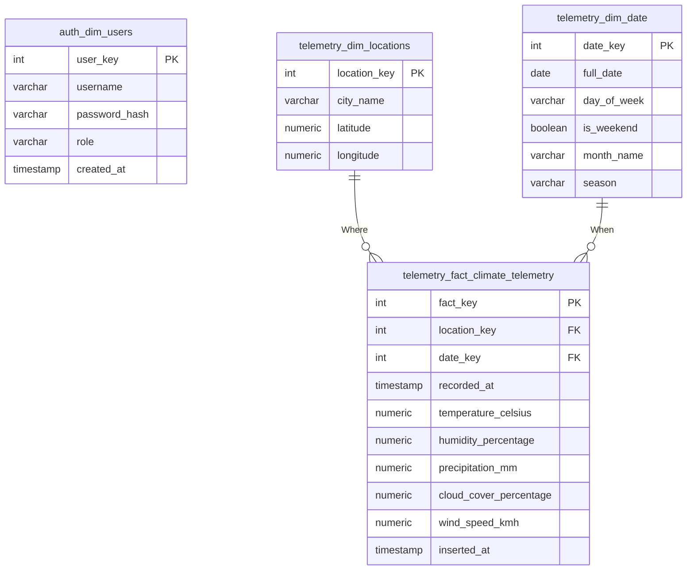

# MeteoSync: Cloud-Native Climate Telemetry Platform

MeteoSync is a lightweight, high-performance telemetry system I built to fetch, process, and analyze regional climate data. The platform ingests hourly weather records from public telemetry APIs, stores them in an optimized Data Warehouse schema, and serves analytics dashboards and dynamic data explorer ledgers through a RESTful backend API.

This project was built to demonstrate **production-level backend and data engineering patterns**, including **Star Schema modeling**, **bulk database loading**, **connection pooling**, and **secure credential management**.

---

## 📊 Database Schema Design

The database is built on PostgreSQL and implements a classic **3-Table Star Schema** optimized for analytical workloads, separated into distinct security namespaces:

## 🚀 Core Architecture & Features

### 1. Database Schema Isolation & Security
To enforce the **Principle of Least Privilege**, the database separates user-authentication tables from telemetry-metrics tables:
*   **`auth` Schema**: Holds the user account dimensions table (`dim_users`).
*   **`telemetry` Schema**: Holds the geographic dimensions, the calendar context (`dim_date`), and telemetry logs.

By isolating tables into different PostgreSQL schemas, the automated pipeline that fetches weather data can only write to the `telemetry` schema and is completely blocked from accessing user credentials. User passwords are encrypted using `hashlib.pbkdf2_hmac` cryptographic hashing.

### 2. Dimensional Data Modeling (Star Schema)
Instead of flat logs or highly normalized tables, data is organized using a **Star Schema** to optimize query performance for the dashboard:
*   **Fact Table (`telemetry.fact_climate_telemetry`)**: Contains quantitative metrics (temperature, precipitation, wind speed) and foreign keys.
*   **Dimension Tables (`telemetry.dim_locations`, `telemetry.dim_date`)**: Provide descriptive contexts. The `dim_date` table is auto-populated with pre-computed calendar data, replacing complex SQL timestamp extraction with fast, readable `JOIN` operations.

### 3. High-Performance Bulk Loading & Idempotency
*   **Batch Ingestion**: Standard database drivers execute bulk inserts sequentially. My ETL pipeline utilizes `psycopg2.extras.execute_values` for high-speed batch ingestion.
*   **Idempotency**: Using PostgreSQL's `ON CONFLICT DO UPDATE` (Upsert), the pipeline can be triggered multiple times a day safely without ever duplicating data.

### 4. API Connection Pooling
Rather than instantiating and tearing down a brand-new TCP database connection on every REST API request, the FastAPI backend uses a thread-safe `ThreadedConnectionPool`, dropping response latency significantly.

### 5. Enterprise Dark Mode UI
The frontend is built entirely with Vanilla HTML, CSS, and JS (No React/Tailwind), proving strong foundational knowledge. It features a modern, glassmorphism dark-mode aesthetic with Chart.js gradient visualizations, dynamic KPI rendering, and a high-performance sticky data grid.

---

## ☁️ Live Cloud Architecture & Deployment

MeteoSync is built with a decoupled architecture, allowing each component to be hosted independently on optimized cloud infrastructure.

*   **🌐 Frontend Application**: Hosted statically on **Vercel** *(Link: [My Vercel URL will be here])*
*   **⚙️ REST API Gateway**: Hosted as a web service on **Render** (Uvicorn / FastAPI).
*   **🗄️ Database Layer**: Hosted on **Azure Database for PostgreSQL**.
*   **🔄 ETL Automation**: The `meteo_to_dbms.py` pipeline is executed daily via **GitHub Actions** cron jobs.

---

## 🛠 Tech Stack

*   **Database:** PostgreSQL
*   **ETL Pipeline:** Python (Requests, Psycopg2)
*   **Backend API:** FastAPI (Uvicorn)
*   **Frontend UI:** Vanilla HTML5, CSS3, JavaScript, Chart.js
*   **Automation:** GitHub Actions cron jobs 
*   **Deployment:** Vercel(Front-End), Render(Back-End), Azure Database for PostgreSQL  
*   **Database Schema:** 3-Table Star Schema
*   **Version Control:** Git and Github
*   **Containerization:** Docker